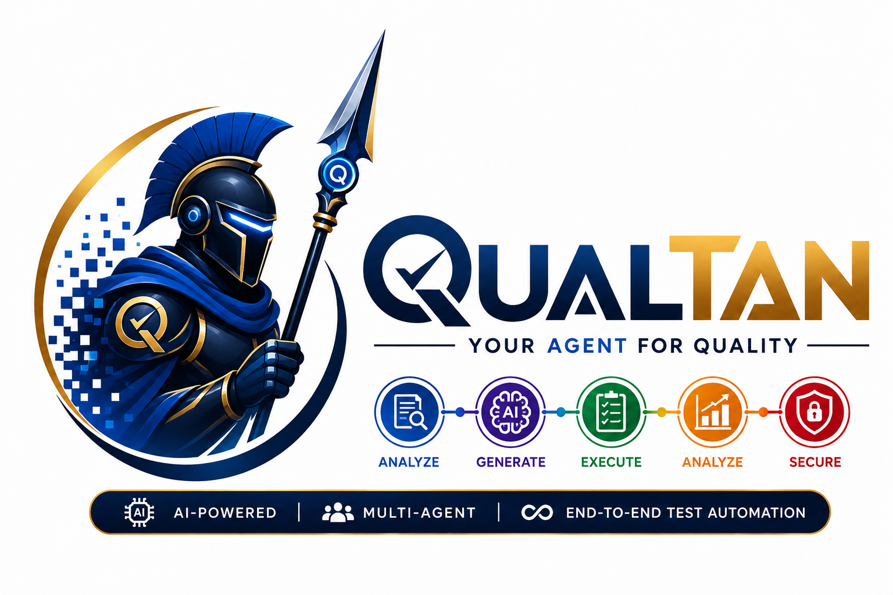

<p align="center">
  
</p>

<p align="center">
  <a href="https://www.python.org/" target="_blank">
    
  </a>
  <a href="https://nodejs.org/" target="_blank">
    
  </a>
  <a href="https://www.typescriptlang.org/" target="_blank">
    
  </a>
  <a href="https://playwright.dev/" target="_blank">
    
  </a>
</p>

# QUALTAN: Governed AI Quality Engineering

QUALTAN is a **typed, durable, and policy-controlled** AI quality engineering framework. It turns requirements into validated test artifacts while keeping probabilistic model reasoning separate from deterministic validation and approval gates.

> **Operating principle:** Models propose and prioritize. Typed contracts, validation gates, policy controls, test runners, and recorded human approvals decide what may proceed.

## Implementation status

The modernization described in this README is implemented in the local framework. The handover record in [`QUALTAN_IMPLEMENTATION_HANDOVER.md`](QUALTAN_IMPLEMENTATION_HANDOVER.md) maps each original g[...]

> The local verification suite currently includes four deterministic regression tests and checks Python compilation, CLI command discovery, MCP configuration validity, and repository whitespace integr[...]

## What is implemented

| Capability | Implementation |
|---|---|
| Typed workflow artifacts | Strict Pydantic contracts for stories, risks, test plans, test code, security plans, performance plans, data, diagnoses, approvals, executions, and reports |
| Schema-constrained generation | A central model gateway requests strict JSON-schema output, validates it, redacts sensitive input, records metadata, retries bounded failures, and caches safe request[...]
| Durable orchestration | A checkpointed work-item state machine persists after each meaningful workflow node and can resume safely after a stop or approval |
| Requirement-to-test workflow | Jira ingestion, requirement analysis, risk-based test planning, Playwright test generation, deterministic validation, and explicit approval handling |
| Generated-code quality gates | Domain schema, acceptance-criteria coverage, source-safety, and TypeScript compilation checks |
| Secure execution boundary | Host allowlisting, safe-command checks, approval requirements, and captured execution evidence |
| Evidence-grounded retrieval | Permission-filtered quality knowledge grounds test plans in approved conventions, schemas, policies, and historical evidence |
| Multimodal healing evidence | Failure diagnosis can consume redacted traces, DOM/accessibility snapshots, network excerpts, and bounded screenshots; it can only propose a review-required patch |
| Operational telemetry | Model task, model ID, prompt version, input hash, latency, and token metrics are written to structured JSONL without persisting prompts or completions |
| Governed integrations | Jira and X-Ray are isolated behind typed gateways; X-Ray mutations require a configured policy and recorded approval |
| Evaluation | Deterministic graders score requirement coverage, validation success, workflow safety, and completion state |
| MCP interoperability | A real MCP server exposes narrow workflow tools; it does not expose ungoverned shell, execution, or mutation tools |
| CI quality controls | Syntax checks, framework tests, Playwright execution, Locust smoke tests, dependency advisory checks, and artifact uploads |

## Architecture

```text
Jira / OpenAPI / test evidence
             |
     Typed ingestion boundary
             |
      Persisted QualityWorkItem
             |
 analyze -> plan -> generate -> approval -> validate
                                  |            |
                            human decision   deterministic gates
                                               |
                                   evidence, evaluation, reporting
                                               |
                         governed Jira / X-Ray / test execution
```

The persisted `QualityWorkItem` is the workflow source of truth. It records the input story, generated artifacts, validation output, approval requests, execution evidence, and a chronological event lo[...]

### Architecture and operations documentation

The editable Mermaid sources and rendered architecture visuals are in [`docs/architecture/`](docs/architecture/). Use the high-level [architecture overview](docs/architecture/qualtan-architecture-over[...]

## Repository layout

| Directory | Responsibility |
|---|---|
| `domain/` | Versioned strict contracts shared by every capability |
| `application/` | Typed model services, workflow orchestration, and the composition root |
| `infrastructure/` | Model gateway, redaction, policy enforcement, artifact persistence, retrieval, multimodal evidence collection, telemetry, and safe execution |
| `integrations/` | Jira and X-Ray adapters; no reasoning logic belongs here |
| `validators/` | Deterministic artifact and source-code quality gates |
| `evals/` | Deterministic quality graders and evaluation CLI |
| `agents/` | Backward-compatible facades that now delegate to typed services |
| `cli/` | Operator commands for workflows and compatibility commands |
| `tests/` | Offline deterministic tests; no live model or Jira account is required |

## Installation

QUALTAN requires Python 3.11+ and Node.js 22+. Copy the environment template before configuring any integration or external target.

```bash
cp .env.example .env
python3 -m pip install -r requirements.txt
npm install
npx playwright install --with-deps chromium
```

The `.env` file must never be committed. At minimum, configure an approved model provider, Jira credentials for Jira-backed flows, and non-production execution hosts. Keep `QUALTAN_ALLOW_EXTERNAL_MUTA[...]

## Policy configuration

| Setting | Default | Effect |
|---|---:|---|
| `QUALTAN_ALLOWED_EXECUTION_HOSTS` | Derived from configured target URLs | Only these hosts can be used for approved test execution |
| `QUALTAN_REQUIRE_APPROVAL_FOR_EXECUTION` | `true` | A recorded approval is mandatory before the runner executes a target |
| `QUALTAN_REQUIRE_APPROVAL_FOR_MUTATIONS` | `true` | A recorded approval is mandatory before external mutations, including X-Ray publishing |
| `QUALTAN_ALLOW_EXTERNAL_MUTATIONS` | `false` | External mutations remain disabled until deliberately enabled |
| `QUALTAN_REDACT_SENSITIVE_DATA` | `true` | Sensitive token, credential, email, and key-like content is redacted before model calls and log persistence |
| `QUALTAN_DEFAULT_MODEL` | `gpt-5-mini` | Default model for bounded extraction, reporting, and routine generation |
| `QUALTAN_REASONING_MODEL` | `gpt-5` | Model used for reasoning-intensive requirement, design, code, and diagnosis tasks |

## Durable workflow commands

The main workflow is intentionally approval-aware. The first command creates a persisted work item, analyzes the story, plans tests, generates test artifacts, and stops before validation when generate[...]

```bash
python3 cli/main.py full-cycle --story QUAL-123
```

The command returns a work-item ID and an approval request ID. Record a human review decision, then resume the work item.

```bash
python3 cli/main.py workflow-approve \
  --work-item <work-item-id> \
  --request <approval-request-id> \
  --approver qa-lead@example.com \
  --note "Reviewed test intent and selector strategy"

python3 cli/main.py workflow-resume --work-item <work-item-id>
python3 cli/main.py workflow-eval --work-item <work-item-id>
```

For a deliberate one-command development run, pass the explicit generated-artifact approval flag. This does **not** enable external mutations or execute against an environment.

```bash
python3 cli/main.py full-cycle --story QUAL-123 --approve-generated
```

### Adding approved quality knowledge

Only an operator should add documents to the project knowledge store. Documents are scope-filtered before retrieval, and their text is treated as evidence rather than executable instructions.

```bash
python3 cli/main.py knowledge-add \
  --document-id playwright-locator-standard \
  --title "Playwright locator standard" \
  --file docs/playwright-locators.md \
  --scope default

python3 cli/main.py knowledge-list
```

## Compatibility commands

The original commands remain available but now call the typed modern services.

| Command | Use |
|---|---|
| `jira-agent --story QUAL-123` | Retrieve and analyze a Jira story |
| `testcase-agent --analysis "..."` | Generate Gherkin and a typed test plan |
| `script-agent --gherkin "..." --type web` | Propose a bounded Playwright artifact |
| `data-agent --schema "..." --count 10` | Generate privacy-aware synthetic data |
| `xray-agent --cases '<TestPlan JSON>'` | Deterministically map a plan to an X-Ray import payload without mutating X-Ray |
| `perf-agent --spec "..."` | Generate a bounded Locust performance plan |
| `security-agent --spec "..."` | Generate safe, authorized security test scenarios |
| `report-agent --results "..."` | Generate a typed executive report |

## Validation and evaluation

Run framework checks locally before merging changes.

```bash
python3 -m compileall -q agents application cli core domain evals infrastructure integrations validators tests mcp_server.py
pytest -q tests
python3 scripts/validate_framework.py
```

For deterministic REST/GraphQL route stubs and project-scoped MCP setup in Cursor, Claude Code, Codex, and Kiro, see the [AI IDE and network testing guide](docs/AI_IDE_AND_NETWORK_TESTING.md). The focused browser mock suite runs with `CI=1 npm run test:mocks` after Playwright Chromium is installed.

Generated test artifacts pass the following gates before a workflow can succeed:

| Gate | Purpose |
|---|---|
| `schema_integrity` | Ensures persisted artifacts conform to strict domain contracts and content hashes |
| `acceptance_criteria_coverage` | Ensures each explicit acceptance criterion maps to a unique test case |
| `generated_test_source_safety` | Rejects unsafe paths, XPath, fixed waits, dynamic evaluation, process execution, and missing assertions |
| `typescript_compile` | Compiles generated TypeScript in an isolated temporary workspace |

The active GitHub Actions workflow in [`.github/workflows/ci-cd.yml`](.github/workflows/ci-cd.yml) runs the same framework tests, optional committed Playwright/Locust checks, advisory scans, artifact [...]

## MCP server

`mcp_server.py` is a real stdio MCP server. It exposes only the following narrow, auditable workflow tools:

| Tool | Side effect |
|---|---|
| `create_quality_work_item` | Reads Jira and persists a new work item |
| `run_quality_workflow` | Runs reasoning/generation and stops for human approval before validation |
| `approve_generated_artifact` | Records a human approval; it does not execute tests or mutate external systems |
| `get_quality_work_item` | Reads persisted workflow state and evidence |

The repository `mcp.json` is configured for the attached local checkout. When moving the repository, update `cwd` and `PYTHONPATH` to the new absolute project directory, and ensure the same approved e[...]

## Security model

QUALTAN treats Jira text, logs, HTML, DOM snapshots, network output, and API specifications as untrusted data. They may be analyzed as evidence but cannot override policy. External changes, repository[...]

## Development notes

The framework is designed for incremental extension. Add a new quality capability by first defining strict domain contracts, then implementing a pure application service, adding deterministic validato[...]

The previous lightweight README is preserved as `README.legacy.md` for historical reference.
