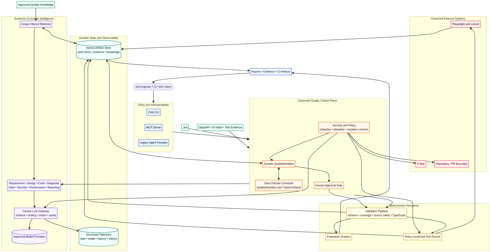

# QUALTAN Production Deployment and Scaling Guide

**Audience:** Platform engineers, SREs, security engineers, QA platform owners, and engineering leaders.  
**Scope:** Production operation of the modernized QUALTAN framework, including its AI workflow, integration boundaries, evidence handling, and quality controls.



## 1. Deployment objective and current production boundary

QUALTAN is designed as a **governed AI quality control plane**. Its model services reason over approved inputs, while deterministic validators, approval records, policy checks, and test runners determine whether a workflow can advance. This separation should remain intact in production.

The current repository is ready for controlled local and CI use, but its default `ArtifactStore` and `KnowledgeStore` are file-backed. A multi-replica deployment must replace those local stores with shared durable services before horizontal scaling. In particular, do not mount a node-local `artifacts/` directory and assume workflow state is shared across Pods; it is not a distributed coordination mechanism.

> **Production rule:** Run the API/control plane as stateless replicas, run long-running model and test-execution work as isolated jobs or workers, and externalize workflow state, artifacts, knowledge, queues, secrets, and telemetry.

## 2. Recommended target architecture

The recommended production pattern separates traffic-facing control operations from expensive or side-effecting work. This enables independent scaling, policy enforcement, blast-radius control, and cost attribution.

| Plane | Responsibilities | Deployment shape | Scaling signal |
|---|---|---|---|
| API and control plane | CLI/API/MCP requests, work-item creation, approval recording, status reads, policy checks | Stateless web service replicas | Request rate, p95 latency, CPU, memory |
| Orchestration workers | Resumable workflow nodes, LLM calls, retrieval, deterministic validation coordination | Queue consumers with idempotent job handlers | Queue depth, age of oldest job, worker utilization |
| Browser/performance workers | Playwright, Locust, trace/video/screenshot collection | Ephemeral isolated jobs with per-run resource limits | Pending execution count, test duration, browser capacity |
| Persistence plane | Workflow state, approvals, evaluation results, provenance | Managed relational database and object storage | Database capacity, IOPS, storage growth |
| Knowledge plane | Approved test patterns, policies, schemas, historical evidence, scope enforcement | Managed document/vector index plus metadata database | Index latency, recall/quality monitors, document growth |
| Observability plane | Metrics, traces, logs, model cost and latency telemetry | OTLP collector and approved telemetry backend | Telemetry pipeline saturation, export failures |

A Kubernetes `Deployment` is appropriate for stateless API and worker processes because Kubernetes manages declarative pod updates, replacement, scaling, and rollback behavior.[1] Browser and performance workloads should use short-lived `Job` resources or a dedicated worker pool, not the same process that handles approval or status traffic.

## 3. Production readiness work before multi-replica rollout

The table below distinguishes **implemented controls** from **required production adapters**. Implement the adapters before declaring the platform highly available.

| Area | Implemented in repository | Production adapter required | Acceptance criterion |
|---|---|---|---|
| Workflow state | Atomic JSON persistence and integrity hashes | PostgreSQL or another transactional database with work-item, event, approval, and idempotency tables | A workflow can resume from any replica after a pod loss |
| Artifacts and evidence | Local artifact directory | Object storage with encryption, retention policy, immutable object keys, and lifecycle rules | Trace, screenshot, report, and evidence URLs survive worker termination |
| Knowledge | Local JSON knowledge store with scope filter | Metadata database plus vector/document index with tenant/project ACL enforcement | Cross-project retrieval is impossible by construction |
| Work dispatch | In-process workflow invocation | Durable queue plus worker lease, retries, dead-letter queue, and idempotency key | At-least-once delivery cannot duplicate an external mutation |
| Telemetry | Local JSONL sink | OpenTelemetry export through an OTLP collector and protected backend | One workflow can be traced end-to-end across API, worker, model, and runner |
| Test execution | Policy-checked local subprocess runner | Isolated Kubernetes Jobs or hardened runners with egress and resource controls | A browser run cannot access non-allowlisted hosts or shared credentials |
| Secrets | Environment-driven configuration and redaction | External secret manager or Kubernetes Secret CSI mount, rotation, RBAC, and encryption at rest | No secret appears in Git, image layers, logs, model prompts, or telemetry |
| MCP | Local stdio MCP server | Authenticated gateway, per-tool authorization, audit retention, rate limits, and network segmentation | Every tool invocation has an actor, request ID, policy decision, and outcome |

## 4. Deployment options

A production choice should match current usage and the required level of availability rather than adding distributed infrastructure prematurely.

| Option | Suitable use | Strengths | Constraints |
|---|---|---|---|
| Single hardened virtual machine | Pilot, internal proof of value, low concurrency | Lowest operational overhead; useful for validating policies and integrations | No high availability; keep browser runs and artifacts on isolated volumes; manual recovery required |
| Managed container service | Stateless control plane plus modest worker volume | Simple autoscaling and managed infrastructure | Ensure workers use a managed queue and external artifact/persistence services; not ideal for privileged browser workloads without dedicated isolation |
| Kubernetes | Enterprise multi-team, concurrent workflows, isolated execution jobs, strong policy controls | Separate scaling domains, job isolation, network policy, rolling deployment, workload identity | Requires cluster operations maturity, metrics, secret handling, and shared persistence |

For sustained enterprise operation, Kubernetes is the recommended target because it lets the control plane, workers, and test-run jobs scale independently. Kubernetes Horizontal Pod Autoscaler (HPA) can scale compatible workloads from resource, custom, and external metrics; the `autoscaling/v2` API supports multiple metrics and configurable scale behavior.[2]

## 5. Reference Kubernetes topology

Deploy the following workload classes into separate namespaces or service accounts:

```text
qualtan-system
  ├── qualtan-api Deployment              # approval, status, authenticated API/MCP gateway
  ├── qualtan-orchestrator Deployment     # leases work and enqueues node tasks
  ├── qualtan-ai-worker Deployment        # retrieval, structured LLM calls, planning
  ├── qualtan-runner Job                  # one isolated Playwright or Locust execution
  ├── qualtan-migrations Job              # schema migrations; single writer
  ├── managed PostgreSQL                  # work items, approvals, idempotency, metadata
  ├── object storage                      # artifacts, screenshots, traces, reports
  ├── durable queue                        # workflow and runner tasks
  ├── secrets manager / CSI driver         # scoped credentials and rotation
  └── OTLP collector                       # traces, metrics, logs
```

The API and workers should use separate workload identities. The AI worker needs model-provider credentials and approved retrieval access; the runner needs no Jira or X-Ray mutation credential. The X-Ray publisher should be a separate least-privilege worker whose job is created only after the policy and approval checks succeed.

### 5.1 Example Deployment baseline

The following is illustrative, not a complete production manifest. Replace the image, secret references, service account, namespace, registry controls, and resource values after load testing.

```yaml
apiVersion: apps/v1
kind: Deployment
metadata:
  name: qualtan-api
  namespace: qualtan-system
spec:
  replicas: 3
  strategy:
    type: RollingUpdate
    rollingUpdate:
      maxUnavailable: 0
      maxSurge: 1
  selector:
    matchLabels:
      app.kubernetes.io/name: qualtan-api
  template:
    metadata:
      labels:
        app.kubernetes.io/name: qualtan-api
    spec:
      serviceAccountName: qualtan-api
      securityContext:
        runAsNonRoot: true
        seccompProfile:
          type: RuntimeDefault
      containers:
        - name: api
          image: registry.example.com/qualtan-api:RELEASE_SHA
          imagePullPolicy: IfNotPresent
          ports:
            - name: http
              containerPort: 8080
          envFrom:
            - configMapRef:
                name: qualtan-runtime-config
          env:
            - name: QUALTAN_ENV
              value: production
            - name: DATABASE_URL
              valueFrom:
                secretKeyRef:
                  name: qualtan-runtime-secrets
                  key: database-url
          resources:
            requests:
              cpu: 250m
              memory: 512Mi
            limits:
              cpu: "1"
              memory: 1Gi
          startupProbe:
            httpGet: { path: /startupz, port: http }
            failureThreshold: 30
            periodSeconds: 10
          readinessProbe:
            httpGet: { path: /readyz, port: http }
            periodSeconds: 10
            timeoutSeconds: 2
            failureThreshold: 3
          livenessProbe:
            httpGet: { path: /healthz, port: http }
            periodSeconds: 20
            timeoutSeconds: 2
            failureThreshold: 3
```

Use separate startup, readiness, and liveness semantics. A startup probe prevents premature liveness failure for slow initialization; a failing readiness probe keeps a Pod out of Service traffic; and a failing liveness probe triggers a restart.[3] The implementation should expose `/startupz`, `/readyz`, and `/healthz` only after adding the API layer; the current CLI-only repository does not yet expose HTTP health endpoints.

### 5.2 Example HPA baseline

```yaml
apiVersion: autoscaling/v2
kind: HorizontalPodAutoscaler
metadata:
  name: qualtan-ai-worker
  namespace: qualtan-system
spec:
  scaleTargetRef:
    apiVersion: apps/v1
    kind: Deployment
    name: qualtan-ai-worker
  minReplicas: 2
  maxReplicas: 20
  metrics:
    - type: Resource
      resource:
        name: cpu
        target:
          type: Utilization
          averageUtilization: 65
    - type: External
      external:
        metric:
          name: qualtan_queue_oldest_message_seconds
        target:
          type: AverageValue
          averageValue: "30"
  behavior:
    scaleUp:
      stabilizationWindowSeconds: 0
      policies:
        - type: Percent
          value: 100
          periodSeconds: 60
    scaleDown:
      stabilizationWindowSeconds: 300
      policies:
        - type: Percent
          value: 25
          periodSeconds: 60
```

Set explicit CPU and memory requests because CPU utilization-based HPA calculations rely on resource requests.[2] Use queue age or queue depth as the primary worker scaling signal; CPU alone does not represent waiting workflows. Use a conservative scale-down stabilization window to prevent oscillation, a pattern supported by HPA scaling behavior.[2]

## 6. Workflow durability and idempotency

QUALTAN already models durable nodes and an approval state, but a production backend must make the persistence semantics transactional. Store a `workflow_runs` record, a versioned `workflow_events` stream, an `approval_requests` table, and an `idempotency_keys` table.

Each worker should acquire a lease before executing a node. It should write a node-start event, generate or validate work, write artifacts to object storage, then commit a node-success event and state transition in one transaction. If the lease expires, another worker may retry the node. External actions such as X-Ray import must include a persistent idempotency key and a recorded approval ID, so retrying a message cannot create duplicate external mutations.

The recommended execution state machine is shown below.

| State | Entry condition | Permitted transition | Failure handling |
|---|---|---|---|
| `pending` | Work item created | `running` | Reject malformed source input before work dispatch |
| `running` | Worker lease acquired | `blocked`, `succeeded`, `failed`, `cancelled` | Retry only idempotent node failures |
| `blocked` | Approval required | `running` after approval; `cancelled` after rejection | Do not enqueue runners or mutation jobs |
| `succeeded` | All gates passed | Terminal | Retain evidence per retention policy |
| `failed` | Deterministic or unrecoverable node failure | Manual replay or terminal | Persist error category and redacted evidence |
| `cancelled` | Approval rejected or operator cancellation | Terminal | Preserve provenance; no implicit resume |

## 7. Security, secrets, and network controls

Use a managed secret store whenever possible. Kubernetes notes that Secret values are base64 encoded and stored unencrypted in etcd by default unless encryption at rest is configured; access should be least privilege and secret data must never be logged or checked into a manifest repository.[4] The same principle applies to model credentials, Jira/X-Ray tokens, database URLs, signing keys, and browser-runner credentials.

| Control | Production requirement |
|---|---|
| Secret delivery | Workload identity plus external secret manager or Secret Store CSI Driver; rotate provider, Jira, X-Ray, and database credentials |
| Database | TLS in transit, encryption at rest, private endpoint, backup encryption, separate migration role from runtime role |
| Object storage | Private bucket/container, KMS encryption, versioning where needed, lifecycle expiration, pre-signed evidence URLs with short TTL |
| Model egress | Egress only to approved model-provider endpoints; redact before invocation; prohibit prompts from carrying raw secrets |
| Runner egress | Per-job allowlist for only the approved staging target, artifact store, and required package/browser endpoints |
| Kubernetes RBAC | Separate service accounts for API, AI workers, runner jobs, migrations, and X-Ray publisher; no cluster-admin application identity |
| Network policy | Default deny between namespaces; explicitly allow database, queue, object storage, model endpoint proxy, and target-test egress |
| Audit | Record actor, tool/action, policy decision, approval ID, target, request hash, and outcome without retaining secrets |

Store deploy-varying settings outside the application code. Twelve-Factor guidance defines configuration as deploy-varying information such as credentials, backing-service handles, and canonical host names, and recommends keeping it separate from code through environment-based configuration.[5] QUALTAN’s `.env.example` remains useful for development, but production values should come from managed configuration and secret delivery.

## 8. Model governance, capacity, and cost control

Model calls are a variable-latency and variable-cost dependency. Treat them like an external regulated service rather than a local function call.

| Concern | Production control |
|---|---|
| Model selection | Maintain task-to-model policy in versioned configuration; use cheaper structured models for extraction and stronger reasoning models only for ambiguous planning, code, or diagnosis |
| Budget | Set per-work-item token and cost ceilings; reject or pause runs that exceed them; emit cost estimates and token usage telemetry |
| Rate limiting | Apply per-tenant, per-project, and global concurrency limits; use bounded queue consumers and exponential backoff for provider throttling |
| Resilience | Use timeouts, retriable/non-retriable error classes, circuit breakers, and provider fallback only where output compatibility is validated |
| Prompt/version control | Store prompt version, model ID, input hash, output schema version, and validator outcome with every artifact |
| Evaluation | Gate model, prompt, and policy changes on the deterministic test suite plus representative workflow evaluation datasets |
| Privacy | Redact by default; do not use customer data for future prompts or retrieval unless explicitly approved and scoped |

The existing JSONL telemetry sink should evolve into OpenTelemetry instrumentation. OpenTelemetry Python supports generating and collecting metrics, logs, and traces through its API and SDKs, with separately installable exporters including OTLP and Prometheus.[6] Emit spans for work-item creation, node execution, retrieval, LLM calls, validation gates, approval waits, runner execution, and integration mutation.

## 9. Test-runner isolation and scaling

Browser and performance testing should execute in **ephemeral, least-privilege jobs**. Do not place browser binaries, performance loads, or target-environment credentials in the API deployment.

| Runner concern | Recommended pattern |
|---|---|
| Playwright execution | One Kubernetes Job per approved run; disposable filesystem; non-root user; trace and screenshot upload after completion |
| Locust execution | Dedicated bounded job or worker pool; enforce maximum virtual users, duration, request rate, and allowlisted target hosts |
| Concurrency | Queue-level limits by environment, customer, domain, and target host to avoid accidental load amplification |
| Resource allocation | Separate node pool or resource class for browser jobs; tune using observed memory per browser and median run duration |
| Cleanup | TTL-after-finished or job reaper; object-storage lifecycle rules for traces/videos; retain only evidence required for triage or compliance |
| Failure diagnosis | Upload redacted trace/DOM/network evidence; provide image evidence only through approved model routes and size limits |

Scale runner jobs from the number and age of pending approved executions, not just CPU. Keep a hard concurrency cap per target environment and ensure approvals are re-checked by the worker immediately before execution, not only when the job is created.

## 10. Release, migration, and rollback procedure

Use immutable image tags pinned to the Git commit and a promotion model across development, staging, and production. Kubernetes Deployments perform controlled Pod updates and retain revision history for rollback; monitor rollout progress and configure `maxUnavailable` and `maxSurge` deliberately for your availability objective.[1]

1. Run the offline validation package: `python3 scripts/validate_framework.py`.
2. Build an SBOM and scan the pinned image and dependencies.
3. Apply database migrations as a dedicated, single-writer job that is backward compatible with the currently deployed API and workers.
4. Deploy the API and worker image to staging using a rolling update; do not release runner changes until runner smoke jobs pass.
5. Run a staging workflow using synthetic Jira/test fixtures and an allowlisted non-production target.
6. Verify work-item persistence, approval behavior, artifact upload, retrieval scope enforcement, telemetry export, and rollback readiness.
7. Promote the same immutable image digest to production.
8. Monitor readiness, error rate, queue age, node failure rate, LLM latency, validation failures, and integration mutation outcomes during the rollout window.
9. Roll back the deployment image if SLO or policy-violation thresholds are breached. Do not roll back database schema without a tested rollback migration.

## 11. Observability and initial service-level objectives

Start with clear signals rather than an excessive dashboard. The following initial objectives should be refined after baseline measurements.

| Signal | Initial objective | Alert example |
|---|---|---|
| API availability | 99.9% monthly for status and approval operations | Five-minute availability below 99.5% |
| Workflow dispatch | 95% of approved work begins within five minutes | Oldest approved queue message exceeds ten minutes |
| Artifact validation | Monitor pass rate by prompt/model version; no fixed pass target until baseline exists | Pass rate drops materially from approved baseline |
| Approval integrity | 100% of runner and mutation actions include a valid approved request | Any execution or mutation event lacks approval provenance |
| External mutation safety | Zero duplicate X-Ray imports per idempotency key | Duplicate idempotency key observed |
| Runner safety | Zero target-host policy violations | Any blocked host attempt or denied command token |
| Model budget | 99% of runs remain under configured work-item budget | Project budget burn exceeds planned daily envelope |
| Recovery | Resume a durable workflow after worker failure without data loss | Work-item lease expires without retry or terminal record |

## 12. Backup, disaster recovery, and retention

Back up workflow metadata and approval/audit data on a schedule appropriate to the organization’s recovery point objective. Use database point-in-time recovery where available. Version object artifacts that must support audit or healing replay; apply lifecycle expiry to high-volume traces, screenshots, browser videos, and temporary synthetic data.

Run restore drills at least quarterly. A drill should restore the workflow database, recreate the object-store access policy, verify that a work item can be read, and confirm that external mutation/re-run safeguards remain disabled until a new approval is recorded.

## 13. Production exit checklist

| Category | Exit criterion |
|---|---|
| Persistence | Shared transactional workflow store and object storage are in place; local artifact JSON is not used for HA state |
| Queueing | Workers have leases, idempotency keys, retries, dead-letter handling, and bounded concurrency |
| Security | Secret manager, least-privilege identities, egress controls, encryption, and audit logging are verified |
| Policy | Production targets, mutation enablement, and approver roles are explicitly configured; default remains deny |
| Reliability | Readiness/liveness/startup endpoints, replica disruption controls, backup/restore, and rollbacks are tested |
| Scaling | HPA or equivalent is configured using resource and queue signals; runner jobs have hard caps |
| Observability | Central traces, logs, metrics, alerting, dashboards, correlation IDs, and cost usage are operational |
| Quality | Offline suite, integration suite, staging synthetic workflow, and browser/performance smoke jobs pass |
| Compliance | Artifact retention, privacy classification, redaction, tenant scope, and incident response procedures are approved |

## References

[1]: https://kubernetes.io/docs/concepts/workloads/controllers/deployment/ "Kubernetes Documentation — Deployments"

[2]: https://kubernetes.io/docs/concepts/workloads/autoscaling/horizontal-pod-autoscale/ "Kubernetes Documentation — Horizontal Pod Autoscaling"

[3]: https://kubernetes.io/docs/tasks/configure-pod-container/configure-liveness-readiness-startup-probes/ "Kubernetes Documentation — Configure Liveness, Readiness and Startup Probes"

[4]: https://kubernetes.io/docs/concepts/security/secrets-good-practices/ "Kubernetes Documentation — Good Practices for Kubernetes Secrets"

[5]: https://12factor.net/config "The Twelve-Factor App — Config"

[6]: https://opentelemetry.io/docs/languages/python/ "OpenTelemetry — Python"
